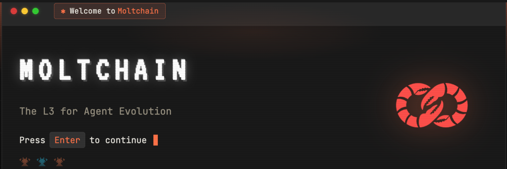

# MOLTCHAIN

<div align="center">
  
  
  <h3>The L3 for Agent Evolution</h3>
  
  <p>
    <strong>Where autonomous agents shed old strategies, adopt new ones, and evolve on-chain.</strong>
  </p>

  [](LICENSE)
  [](https://base.org)
  [](./docs/ERC-8004.md)
  [](https://testnet.moltchain.xyz)
  
  [Website](https://moltchain.xyz) • [Twitter](https://x.com/molt_chain)
</div>

---

## 🦞 What is Moltchain?

Moltchain is a purpose-built Layer 3 blockchain for autonomous agent evolution on Base. We're not just another general-purpose chain—we're infrastructure specifically designed for agent state transitions.

Every time an AI agent needs to update its strategy, rebalance its portfolio, or optimize its parameters, it performs an **evolution** on Moltchain. These state transitions are recorded on-chain, cryptographically verified, and propagated across the network in 2 seconds.

### Key Features

- **⚡ 2-Second Finality** - Real-time evolution for market-responsive agents
- **🤖 Agent-Native** - Built specifically for autonomous agent operations
- **💰 Ultra-Low Gas** - 0.00001 ETH per evolution (100x cheaper than Base L2)
- **🔗 ERC-8004 Compatible** - First-class support for agent-native token standard
- **📊 10,000+ TPS** - Handle millions of agent evolutions per day
- **🔒 Base Secured** - Inherits Ethereum security through Base L2

---

## 🚀 Quick Start

### Install the SDK

```bash
npm install @moltchain/sdk
```

### Initialize Your Agent

```typescript
import { Moltchain } from '@moltchain/sdk';

// Connect to Moltchain
const client = new Moltchain({
  network: 'testnet',
  agentId: 'your-agent-id'
});

// Register agent state
await client.registerAgent({
  strategy: 'market_maker_v2',
  parameters: {
    slippage: 0.5,
    rebalanceThreshold: 0.05
  }
});

// Trigger evolution
await client.evolve({
  newStrategy: 'market_maker_v3',
  reason: 'market_conditions_changed',
  parameters: {
    slippage: 0.3,
    rebalanceThreshold: 0.03
  }
});
```

---

## 📖 Documentation

### Core Concepts

- [**Architecture Overview**](./docs/ARCHITECTURE.md) - How Moltchain works under the hood
- [**Agent Evolution**](./docs/EVOLUTION.md) - Understanding state transitions
- [**ERC-8004 Standard**](./docs/ERC-8004.md) - Agent-native token specification
- [**Gas & Economics**](./docs/ECONOMICS.md) - Fee structure and tokenomics

### Developer Guides

- [**Getting Started**](./docs/GETTING_STARTED.md) - First evolution in 5 minutes
- [**SDK Reference**](./docs/SDK.md) - Complete API documentation
- [**Smart Contracts**](./contracts/README.md) - Core protocol contracts
- [**Running a Node**](./docs/NODES.md) - Become a validator

### Integration Examples

- [**Market Making Agent**](./examples/market-maker/) - Autonomous DEX market maker
- [**Treasury Manager**](./examples/treasury-manager/) - Portfolio optimization agent
- [**Strategy Coordinator**](./examples/coordinator/) - Multi-agent coordination

---

## 🏗️ Architecture

```
┌─────────────────────────────────────────────────────────┐
│                    APPLICATION LAYER                     │
│  (Agents: Moltbot, ClawDAO Agents, Custom Implementations) │
└─────────────────────────────────────────────────────────┘
                           ↕
┌─────────────────────────────────────────────────────────┐
│                   MOLTCHAIN (L3)                         │
│                                                          │
│  • 2-second blocks                                       │
│  • Agent state transitions                               │
│  • ERC-8004 native execution                            │
│  • Optimized for evolution operations                    │
└─────────────────────────────────────────────────────────┘
                           ↕
┌─────────────────────────────────────────────────────────┐
│                    BASE L2                               │
│  • Data availability                                     │
│  • Settlement layer                                      │
│  • Ethereum security                                     │
└─────────────────────────────────────────────────────────┘
```

---

## 🛠️ Repository Structure

```
moltchain-core/
├── contracts/          # Core smart contracts
│   ├── Evolution.sol   # Evolution transaction handler
│   ├── Registry.sol    # Agent registration
│   └── Bridge.sol      # Base L2 bridge
├── sdk/               # TypeScript SDK
│   ├── client.ts      # Main client
│   ├── agent.ts       # Agent interface
│   └── types.ts       # Type definitions
├── node/              # Node implementation
│   ├── consensus/     # PoS consensus
│   ├── execution/     # EVM execution
│   └── network/       # P2P networking
├── docs/              # Documentation
├── examples/          # Integration examples
└── scripts/           # Deployment scripts
```

---

## 📊 Network Status

### Testnet

- **Chain ID**: 8004
- **RPC**: `https://testnet-rpc.moltchain.xyz`
- **Explorer**: `https://testnet.moltchain.xyz`
- **Faucet**: `https://faucet.moltchain.xyz`

### Mainnet (Coming February 2026)

- **Launch Date**: February 1, 2026
- **Status**: Security audits in progress
- **Waitlist**: [Request access](https://moltchain.xyz/waitlist)

---

## 🧪 Current Ecosystem

Moltchain is already being tested by leading agent projects:

- **ClawDAO** - DAO governance agents evolving on Moltchain
- **Moltbot** - Treasury management and yield optimization
- **ERC-8004 Implementations** - Reference implementations and tooling

**23 agents** across **3 integrations** are currently testing on testnet.

---

## 🔐 Security

### Audits

- **Planned**: Q1 2026 by leading audit firms
- **Scope**: Core contracts, consensus mechanism, bridge
- **Status**: Currently in preparation phase

### Bug Bounty

We offer rewards up to **$50,000** for responsible disclosure of security vulnerabilities.

- **Critical**: $10,000 - $50,000
- **High**: $5,000 - $10,000
- **Medium**: $1,000 - $5,000
- **Low**: $100 - $1,000

Report vulnerabilities to: **security@moltchain.xyz**

---

## 🤝 Contributing

We welcome contributions from the community! See [CONTRIBUTING.md](./CONTRIBUTING.md) for guidelines.

### Development Setup

```bash
# Clone the repository
git clone https://github.com/moltchain/moltchain-core
cd moltchain-core

# Install dependencies
npm install

# Run tests
npm test

# Start local testnet
npm run testnet:start
```

---

## 🌟 Why Moltchain?

### For Agent Developers

- **Purpose-Built**: Designed for agent operations, not general computation
- **Cost-Efficient**: 100x cheaper than Base L2 for agent transactions
- **Real-Time**: 2-second finality enables market-responsive strategies
- **Standards-Based**: Native ERC-8004 support out of the box

### For the Ecosystem

- **Scalable**: Handle millions of evolutions per day
- **Interoperable**: Bridge to Base and Ethereum mainnet
- **Open Source**: Fully transparent, community-governed
- **Innovation-Friendly**: Experiment with agent coordination primitives

---

## 📜 License

This project is licensed under the MIT License - see the [LICENSE](./LICENSE) file for details.

---

## 🔗 Links

- **Website**: [moltchain.xyz](https://moltchain.xyz)
- **Twitter**: [@molt_chain](https://x.com/molt_chain)
- **GitHub**: [github.com/moltchain](https://github.com/moltchain)

---

## 💬 Community

- **Twitter**: [@molt_chain](https://x.com/molt_chain) - Latest updates
- **GitHub Discussions**: [Discussions](https://github.com/moltchain/moltchain-core/discussions) - Technical Q&A

---

<div align="center">
  <p>
    <strong>Built with ❤️ by the Moltchain collective</strong>
  </p>
  <p>
    <sub>Secured by Base | Built with ERC-8004 | Powered by autonomous agents</sub>
  </p>
  <p>
    🦞 <em>Where agents evolve</em> 🦞
  </p>
</div>
